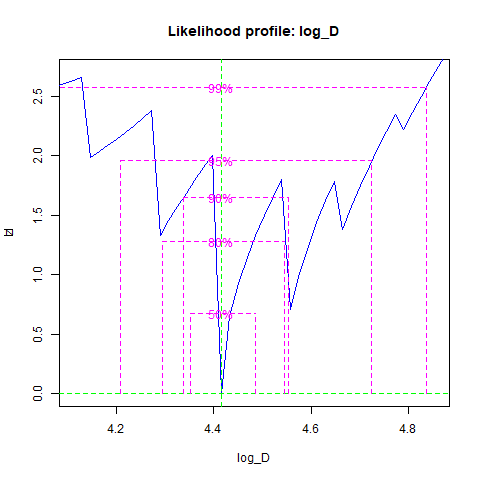

```{r, include = FALSE}
knitr::opts_chunk$set(
  warning = FALSE, 
  message = FALSE,
  collapse = TRUE,
  comment = "#>"
)
```

Load the *tag* package:
```{r setup, echo = FALSE}
# library(tag)
# library(terra)
# library(tictoc)
# library(tidyterra)
# library(dplyr)
# library(stars)
# library(bbmle)
# library(imager)
```

```{r} 
devtools::load_all() # To delete

bathy <- cod_ex[[1]]
stars::st_dimensions(bathy)$x$delta # resolution in x direction
stars::st_dimensions(bathy)$y$delta # resolution in y direction
h <- stars::st_dimensions(bathy)$x$delta

land <- bathy %>%
  dplyr::mutate(depth = ifelse(depth < 15, 0, 1)) # 15-m cutoff, but can change as needed

fish_data <- cod_ex[[3]]
L <- cod_ex[[4]]
```

You can estimate diffusion coefficients through maximum likelihood estimation. The est_1d function returns the negative log likelihood.

``` {r}
tag::est_1d(log_D = log(90), h = h, L = L, land = t(land$depth))
# example, returns the negative log likelihood

# 
# Params <- list(log_D = log(90))
# Data <- list(h = h, L = L, land = t(land$depth))
# est_1D <- mle2(est_1d, 
#                start = Params, 
#                data = Data, 
#                method = "Brent", 
#                optimizer = "optim",
#                lower = log(1),
#                upper = log(300)) # need to choose upper and lower boundaries
# prof <- profile(est_1D)

```
Need to sort out why the likelihood is 'jagged', perhaps something to do with the resolution and changing to map units?

Also, when not log transforming D, the estimate appears to have been a localized minimum, and when I try to make a profile, it says that the model actually did not converge and it found a better solution that is in line with the log transformed version...

This first example uses a single D, and this no longer uses the *raster* but still uses the *imager* package to convolve. 
```{r, fig.height = 20, fig.width = 12}
tictoc::tic()
smooth <- tag::fwd_bck(D = 94, h = h, L = L, land = t(land$depth), fish_data = fish_data)
tictoc::toc()

sm_ras <- terra::rast(smooth)
par(mfrow = c(4,1))
terra::plot(sm_ras[[20]])
terra::plot(sm_ras[[40]])
terra::plot(sm_ras[[60]])
terra::plot(sm_ras[[80]])
```

This version only has removed *raster* and *imager* packages, and is mainly using the *terra* package. One main difference is that the land layer is passed in as a SpatRaster. One nice feature of this version is that there is no transposing for going between a raster and a matrix/array like there was before.

```{r, fig.height = 20, fig.width = 12}
bathy <- terra::rast(cod_ex[[1]]) # load bathymetry as a stars object, but convert to terra raster
names(bathy) <- "depth"
h <- terra::res(bathy)[1] # resolution in meters

# identify land as a 0
land2 <- bathy %>%
  dplyr::mutate(depth = ifelse(depth < 15, 0, 1)) %>% 
  dplyr::select(depth) # 15-m cutoff, but can change as needed

tictoc::tic()
smooth <- tag::fwd_bck_terra(D = 94, h = h, L = L, land = land2, fish_data = fish_data)
tictoc::toc()

sm_ras <- terra::rast(smooth)
par(mfrow = c(4,1))
terra::plot(sm_ras[[20]])
terra::plot(sm_ras[[40]])
terra::plot(sm_ras[[60]])
terra::plot(sm_ras[[80]])
```

```{r, fig.height = 10, fig.width = 15}
err_gr <- tag::err_grid(smooth = smooth, fish_data = fish_data)

err.grid.99 <- tag::err_gr[names(err_gr) == "q99"]

err.grid.50 <- tag::err_gr[names(err_gr) == "q50"]

#Need to make list into one data frame with multiple polygons
polygons.99 <- err.grid.99[[1]]
for(i in 2:length(err.grid.99)) {
  polygons.99 <- rbind(polygons.99, err.grid.99[[i]])
}

polygons.50 <- err.grid.50[[1]]
for(i in 2:length(err.grid.50)) {
  polygons.50 <- rbind(polygons.50, err.grid.50[[i]])
}

plot(bathy)
plot(polygons.99 %>% filter(lyr.1 == 1), col = "gray", border = "gray", add = TRUE)
plot(polygons.50 %>% filter(lyr.1 == 1), col = "blue", border = "blue", add = TRUE)
plot(land2 %>% filter(depth == 0), col = "gray10", add = TRUE)
```

